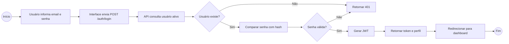
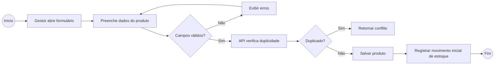
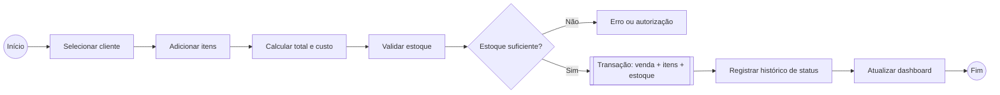
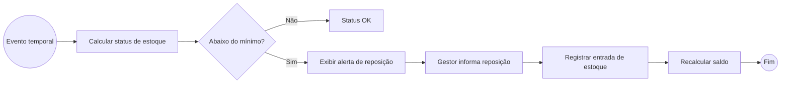
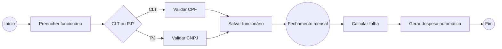
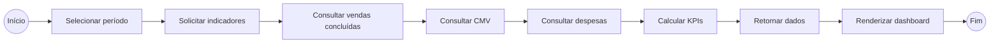

# Modelagem de Processos — BPMN Textual do ERP GENNUS 2.0

**Data da análise:** 2026-06-20  
**Formato:** descrição BPMN 2.0 textual, com raias, eventos, tarefas e desvios.  
**Observação:** Os diagramas abaixo usam Mermaid para facilitar versionamento no GitHub. A descrição textual pode ser desenhada depois em Bizagi, Camunda Modeler, Draw.io ou Miro.

## 1. Processo: Login e acesso ao ERP

### Raias

| Raia | Responsabilidade |
|---|---|
| Usuário | Informa email e senha |
| Interface Web | Captura formulário e chama API |
| API Auth | Valida credenciais e emite token |
| Banco de Dados | Consulta usuário, empresa e perfil |

### Fluxo BPMN textual

1. **Evento de início:** usuário abre a tela de login.
2. **Tarefa de usuário:** usuário preenche email e senha.
3. **Tarefa de serviço:** interface envia `POST /auth/login`.
4. **Tarefa de serviço:** API consulta usuário ativo pelo email.
5. **Desvio exclusivo:** usuário existe?
   - Não: retornar erro de credenciais.
   - Sim: continuar.
6. **Tarefa de regra de negócio:** comparar senha informada com `senha_hash`.
7. **Desvio exclusivo:** senha é válida?
   - Não: retornar erro de credenciais.
   - Sim: emitir JWT.
8. **Tarefa de envio:** API retorna token, usuário, empresa e perfil.
9. **Tarefa de usuário:** interface armazena sessão e redireciona para dashboard.
10. **Evento de fim:** usuário autenticado no ERP.

## 2. Processo: Cadastro e manutenção de produto

### Raias

| Raia | Responsabilidade |
|---|---|
| Gestor | Informa dados do produto |
| Interface Web | Valida campos básicos |
| API Produtos | Aplica regras e persiste |
| Banco de Dados | Armazena produto, categoria e estoque inicial |

### Fluxo BPMN textual

1. **Evento de início:** gestor clica em “Novo Produto”.
2. **Tarefa de usuário:** preencher nome, categoria, unidade, custo, preço e estoque.
3. **Tarefa de regra de negócio:** validar campos obrigatórios e valores monetários.
4. **Desvio exclusivo:** dados válidos?
   - Não: exibir mensagens de erro.
   - Sim: enviar para API.
5. **Tarefa de serviço:** API verifica duplicidade de EAN/nome na empresa.
6. **Desvio exclusivo:** produto duplicado?
   - Sim: retornar conflito.
   - Não: criar produto.
7. **Tarefa de serviço:** registrar estoque inicial como movimentação do tipo `ENTRADA` ou `AJUSTE_INICIAL`.
8. **Evento de fim:** produto disponível no catálogo.

## 3. Processo: Registro de venda com baixa de estoque

### Raias

| Raia | Responsabilidade |
|---|---|
| Operador | Escolhe cliente e itens |
| Interface Web | Monta carrinho e envia venda |
| API Vendas | Calcula totais e valida estoque |
| API Estoque | Registra movimentação |
| Banco de Dados | Persiste venda, itens e movimentos |

### Fluxo BPMN textual

1. **Evento de início:** operador inicia uma venda.
2. **Tarefa de usuário:** selecionar cliente ou venda avulsa.
3. **Tarefa de usuário:** adicionar produtos e quantidades.
4. **Tarefa de regra de negócio:** calcular subtotal, desconto, total e custo.
5. **Tarefa de serviço:** API valida estoque de cada item.
6. **Desvio exclusivo:** há estoque suficiente?
   - Não: bloquear venda ou pedir autorização.
   - Sim: continuar.
7. **Subprocesso transacional:** gravar venda, gravar itens e baixar estoque.
8. **Tarefa de serviço:** registrar histórico de status da venda.
9. **Tarefa de envio:** retornar venda criada.
10. **Evento de fim:** venda registrada e estoque atualizado.

## 4. Processo: Reposição e alerta de estoque

### Raias

| Raia | Responsabilidade |
|---|---|
| Sistema | Detecta estoque baixo |
| Gestor | Decide repor |
| API Estoque | Registra entrada |
| Banco de Dados | Atualiza saldo por movimentação |

### Fluxo BPMN textual

1. **Evento temporal:** sistema recalcula indicadores de estoque periodicamente ou ao abrir tela.
2. **Tarefa de regra de negócio:** comparar `estoque_atual` com `estoque_minimo`.
3. **Desvio exclusivo:** produto abaixo do mínimo?
   - Não: manter status normal.
   - Sim: exibir alerta.
4. **Tarefa de usuário:** gestor informa quantidade de reposição.
5. **Tarefa de serviço:** API registra movimento de entrada.
6. **Tarefa de regra de negócio:** novo saldo é recalculado.
7. **Evento de fim:** alerta encerrado quando saldo fica acima do mínimo.

## 5. Processo: Funcionários e despesas automáticas

### Raias

| Raia | Responsabilidade |
|---|---|
| Gestor | Cadastra funcionário |
| Interface Web | Valida dados |
| API Funcionários | Persiste cadastro |
| Motor Financeiro | Calcula folha como despesa |
| Banco de Dados | Armazena funcionários e despesas |

### Fluxo BPMN textual

1. **Evento de início:** gestor abre cadastro de funcionário.
2. **Tarefa de usuário:** informar nome, contrato, documento, salário, benefícios e status.
3. **Desvio exclusivo:** tipo é CLT ou PJ?
   - CLT: validar CPF e benefícios trabalhistas.
   - PJ: validar CNPJ e dados de contrato.
4. **Tarefa de serviço:** API salva funcionário.
5. **Evento temporal mensal:** motor financeiro calcula folha do período.
6. **Tarefa de regra de negócio:** somar salários e benefícios de funcionários ativos.
7. **Tarefa de serviço:** gerar despesa automática de folha.
8. **Evento de fim:** folha considerada nos relatórios.

## 6. Processo: Apuração financeira e dashboard

### Raias

| Raia | Responsabilidade |
|---|---|
| Usuário/Gestor | Seleciona período |
| Interface Web | Solicita indicadores |
| API Relatórios | Agrega dados |
| Banco de Dados | Consulta vendas, itens, despesas e funcionários |

### Fluxo BPMN textual

1. **Evento de início:** gestor acessa dashboard.
2. **Tarefa de usuário:** selecionar período.
3. **Tarefa de serviço:** interface chama endpoint de indicadores.
4. **Tarefa de serviço:** API consulta vendas concluídas.
5. **Tarefa de serviço:** API consulta CMV pelos itens de venda.
6. **Tarefa de serviço:** API consulta despesas manuais e folha.
7. **Tarefa de regra de negócio:** calcular receita, despesas, lucro e margem.
8. **Tarefa de envio:** retornar KPIs e séries temporais.
9. **Tarefa de usuário:** dashboard renderiza cards, gráficos e ranking.
10. **Evento de fim:** gestor visualiza saúde do negócio.

## 7. Eventos de erro recomendados

| Processo | Evento de erro | Tratamento |
|---|---|---|
| Login | Credenciais inválidas | Retornar 401 sem informar se email existe |
| Produto | Duplicidade | Retornar 409 com mensagem clara |
| Venda | Estoque insuficiente | Bloquear operação e indicar produto afetado |
| Estoque | Movimento negativo inválido | Rejeitar ajuste sem autorização |
| Financeiro | Período sem dados | Exibir estado vazio e zerar KPIs |
| API | Token expirado | Retornar 401 e redirecionar para login |

## 8. Observação de maturidade

Os fluxos acima representam o comportamento desejado para um ERP real. No projeto atual, vários passos são executados apenas no navegador, com dados simulados ou `localStorage`. A evolução arquitetural deve mover regras críticas para o backend.

